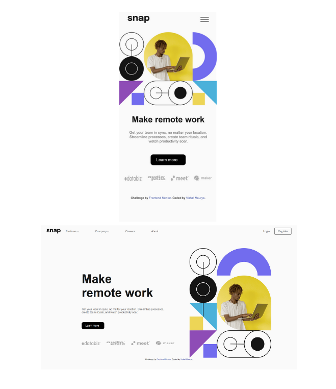

# Frontend Mentor - Intro section with dropdown navigation solution

This is a solution to the [Intro section with dropdown navigation challenge on Frontend Mentor](https://www.frontendmentor.io/challenges/intro-section-with-dropdown-navigation-ryaPetHE5). 

## Table of contents

- [Overview](#overview)
  - [The challenge](#the-challenge)
  - [Screenshot](#screenshot)
  - [Links](#links)
- [My process](#my-process)
  - [Built with](#built-with)
  - [Continued development](#continued-development)
  - [Useful resources](#useful-resources)
- [Author](#author)

## Overview

### The challenge

-the main challenge is to create desktop view.
### Screenshot

### Links

- Solution URL: [View Code](https://github.com/VishalMauryastp/intro-section-with-dropdown-navigation-main)
- Live Site URL: [Preview](https://vishalmauryastp.github.io/intro-section-with-dropdown-navigation-main/)
## My process

### Built with

- Semantic HTML5 markup
- CSS custom properties
- Flexbox
- CSS Grid
- Mobile-first workflow
-scss

### Continued development

- first cerate desktp view then create mobile view.
### Useful resources

- [Figma] - This helped me for measuring the width ,height & entire design . I really liked this pattern and will use it going forward.
- [Google Fonts] - This is a fonts resoures where you can find any style of fonts.

## Author
- Gitgub - [@Vishal Mauruya](https://github.com/VishalMauryastp)
- Frontend Mentor - [@Vishal Mauruya](https://www.frontendmentor.io/profile/VishalMauryastp)
- LinkedIn - [@Vishal Maurya](https://www.linkedin.com/in/in-vishalmaurya/)
- Instagram-[@Vishal Maurya](https://www.instagram.com/VishalMauryastp)

